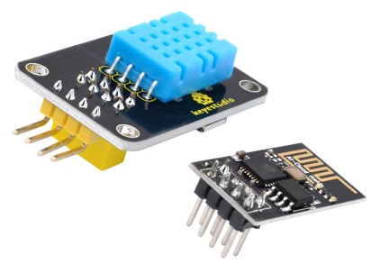
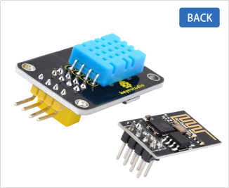
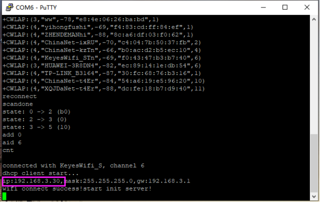
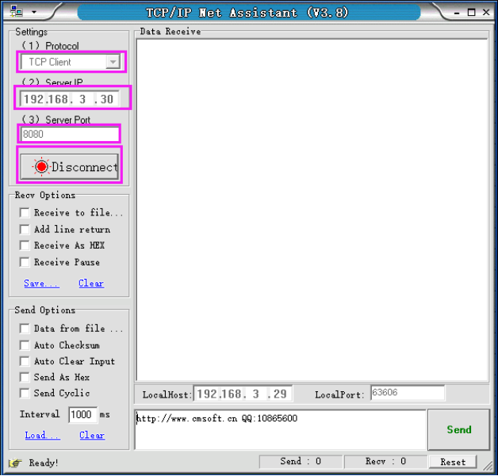
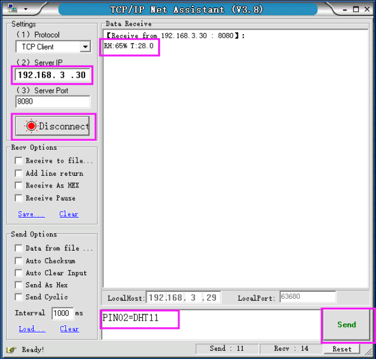
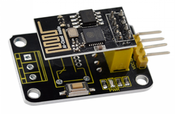
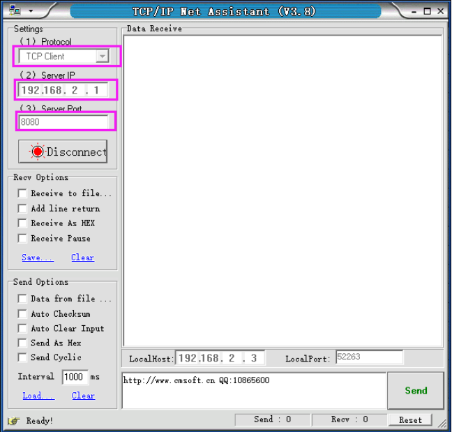
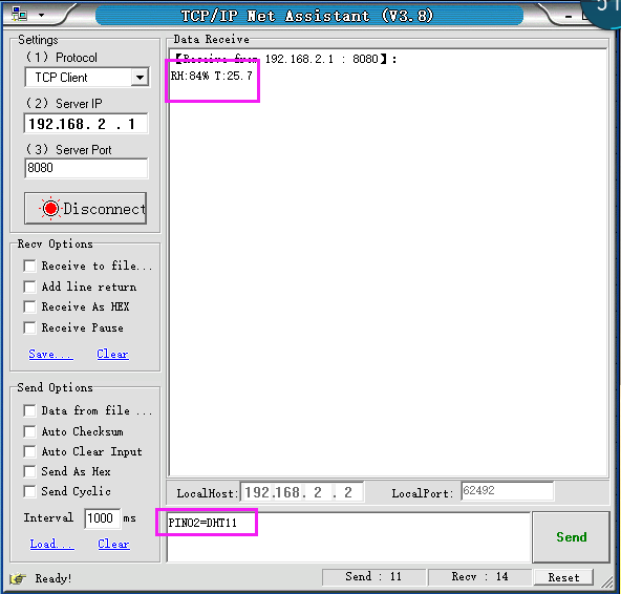

# KS0409 Keyestudio ESP-01 DHT11 Temperature and Humidity Module

Download Resources :  [Resources](./Resources.7z)



## 1. Description

DHT11 Temperature and Humidity Module is one of the most commonly used components for setting the smart home when we are doing the Internet of Things.

For wireless control, we specially designed this ESP-01 DHT11 Temperature and Humidity module. 

The DHT11 Temperature and Humidity module is equipped with an ESP8266-01 Wifi module, which can access to the wireless network.

You can remote control any other devices according to the temperature and humidity data measured by the DHT11 module.

For simple use, we provide our own compiled firmware, the firmware is server mode. The specific information are as follows:

- **Module working mode:**

```
work in mode:3
```

- **Softap mode:**

```
softAP SSID: KeyesWifi_A  ;  password: KeyesWifi   
softAP IP: 192.168.2.1    
softAP_server IP: 192.168.2.1
```

- **Station mode:**

```
Station SSID: KeyesWifi_S  ;  password: KeyesWifi   
Station IP: automatic router assignment   
Station_server IP: Router automatically assigns port:8080   
```

## 2. Specifications

- Working voltage: DC 3V--3.3V
- Main control chip: ESP8266-01
- Button function: reset button
- Temperature range: 0℃ to 50℃±2℃
- Humidity range: 20-90%RH±5%RH
- Dimensions：42mm * 24mm * 22mm
- Weight：5.7g

## 3. Packing Includes

- Keyestudio DHT11 Temperature and Humidity module x 1
- ESP8266-01 Wifi module x 1




## 4. Use Methods

**1. Burn the Firmware**

We have already burned the firmware in the ESP8266-01 WIFI module. And you can re-burn the firmware by yourself as well.

The programming method is as follows:

**①**Plug the ESP8266 WIFI module onto the keyestudio USB to ESP-01S Wifi shield, and push the shield’s button to **Uart Download** end. Then can directly connect them to your computer’s USB port.


**②** Double click to open **FLASH_DOWNLOAD_TOOL**, as shown in the figure below, uploading the firmware.


You will see the interface window below.


Then open the ESP8266 Download Tool.

For SPIDownload, open the corresponding file. As shown below.


After click to start download, the interface is as shown below.


**2.Station Mode Operation**

Because the station_server IP is automatically assigned by the router, so need to read the IP from the serial port. For example:

**①** Set the SSID of the home Wifi to: KeyesWifi_S and password is KeyesWifi (note here should set your own home wifi).

**②** Directly connect the keyestudio USB to ESP-01S Wifi shield to your computer’s USB port. Then push the shield’s button to **Flash Boot** side.


**③** Open the PUTTY software on your computer. Below is the example figure we operate.


Double-click the icon of PUTTY software, pop up the interface window below.


After Click Open, plug the ESP8266 WIFI module into keyestudio USB to ESP-01S Wifi shield.

Note must click **Open** first, then plug the ESP8266 WIFI module into keyestudio USB to ESP-01S Wifi shield. Or else it is invalid.


**④** The PUTTY terminal will print the message showed below. IP read success!



From the figure, remember your IP name, here is **192.168.3.30**

**⑤**The computer and the home wifi are in the same LAN, and the network segment is the same. Connect your computer to your home WiFi. For example, here we use: **SSID: KeyesWifi_S  ; Password: KeyesWifi**

**⑥**Plug the ESP8266-01 WIFI module into the DHT11 Temperature and Humidity module and access to 3.3V power supply.


**⑦** Open the network debugging assistant software, as shown below.




**⑧**Send **PIN02=DHT11**, print out the temperature and humidity data.



For the Station mode operation, the test is finished!

**3.Softap Mode Operation**

**①**The computer and the home wifi are in the same LAN, and the network segment is the same. Change your home wifi name to avoid wifi module automatic connected.

**②**Connect your computer to your home WiFi. For example, here we use: **SSID: KeyesWifi_A  ; Password: KeyesWifi**

**③** Plug the ESP8266-01 WIFI module into the DHT11 Temperature and Humidity module and access to 3.3V power supply and wait for 20 seconds.



**④**Open the network debugging assistant software, as shown below.




**⑤**Send **PIN02=DHT11**, print out the temperature and humidity data.



For the Softap mode operation, the test is finished!